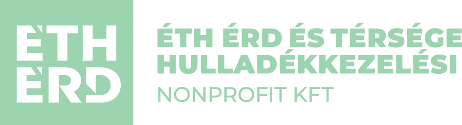

# HA_custom_integration_-ETH_waste
Custom integration for Home Assistant, which enables collecting  data from ÉTH waste collection shedule.

Installation
1. Open HACS in your HA installation, and add this repository: https://github.com/tvarszegi1/HA_custom_integration_-TH_waste
2. Search for the integration in HACS, then download it.
3. Restart HA as prompted.
4. Navigate to Settings -> Devices & Services in Home Assistant, click "Add Integration". Look for "Érd Waste Collection" -> add.
5. Setup your integration on the UI.

This integration supports the following locations:
1. Érd
2. Diósd
3. Sóskút
4. Tárnok
5. Ráckeresztúr

The integration will create 3 or 4 entities (3 for locations with separate communal / green / selective shedules, and 4 for locations with separate communal / green / selective / glass shedules).
The entities shows the next date for each specific type of waste collection. It will recheck the data in  every 12 hours.

This integration supports HA calendar.

You can also use markdown cards, such as the following:

### ♻️ Érd Szelektív (Next 5 Pickups)

- {{ date }}


### 🌿 Érd Zöldhulladék (Next 5 Pickups)

- {{ date }}


IMPORTANT: this integration is not an official addon made by ÉTH in any way. The creators are not responsible for the validity of the fetched data. This integration does not utilize any API keys or other secrets which can be used for malicious purposes.
The ÉTH logo and brand name only displayed for making the integration easier to identify. The creators do not profit from the this integration in any way.